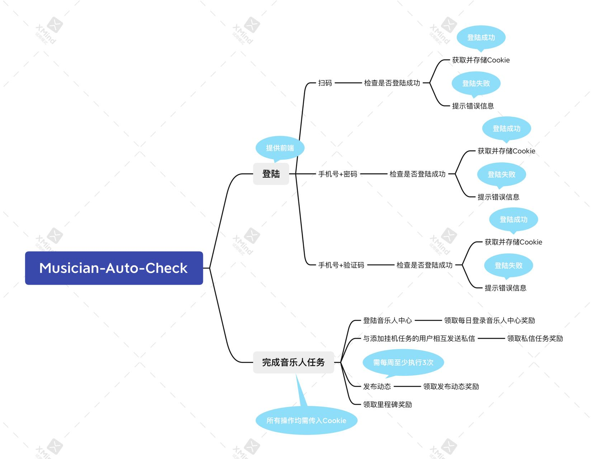

<div style="text-align: center;">

# Auto-Musician


</div>

## 使用

访问 Auto-Musician 站点（例如[本项目的官方站](https://ncm.lamgc.moe/) ）， 点击“二维码登录”，出现二维码后扫码登录，如显示“登录成功”字样，即可完成登录，之后交给 Auto-Musician
进行自动操作即可。

## 安装

> 注意：本章节仅适用于有自行搭建 Auto-Musician 需要的用户，如果没有这个想法，请不要照做。

环境要求：

- Java 11（或以上）
- MySQL 8 / MariaDB

### 关于 SSL

Auto-Musician 在 1.0.0-rc4 中添加了内置的 Https 支持，可直接使用；  
如果需要使用前置 Web 网关的话，也可以不启用 Https。

### 手动安装

1. 下载最新版的 Auto-Musician（[发布页面](https://github.com/LamGC/Auto-Musician/releases/latest)）
2. 解压到服务端，并使用 Java 启动一次，生成 `config.json` 配置文件
3. 在配置文件中配置好 MySQL 服务器连接信息, 如有需要可更改其他配置
4. 确保 MySQL 服务器正在运行，再次启动 Auto-Musician，如显示
   ```
   The automatic musician is awake! He's working now!
   ```
   则安装成功。

### Docker 安装

## 项目构图



## 许可证

本项目采用 `GNU Affero General Public License v3.0` 协议

```
Copyright (C) 2021  LamGC

This program is free software: you can redistribute it and/or modify
it under the terms of the GNU Affero General Public License as published
by the Free Software Foundation, either version 3 of the License, or
(at your option) any later version.

This program is distributed in the hope that it will be useful,
but WITHOUT ANY WARRANTY; without even the implied warranty of
MERCHANTABILITY or FITNESS FOR A PARTICULAR PURPOSE.  See the
GNU Affero General Public License for more details.

You should have received a copy of the GNU Affero General Public License
along with this program.  If not, see <https://www.gnu.org/licenses/>.
```
